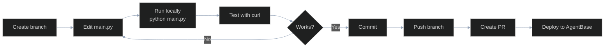

# agent007 — Zero-to-Hero Contributor Guide

> Audience: New contributors who want to run, extend, and ship this agent.

---

## 1. What This Project Does

**agent007** is an AI-powered work management agent that integrates Jira, Confluence, and Notion into a single conversational interface. You send it a message (or let it run on a schedule), and it fetches your tasks, reports status, takes actions like creating Confluence pages, and pings you for review when something is ambiguous.

It runs on the **GreenNode AgentBase** platform — VNGCloud's hosted AI agent runtime — and is deployed as a Docker container.

---

## 2. Prerequisites

| Tool | Version | Install |
|---|---|---|
| Python | 3.10+ (3.12 recommended) | https://www.python.org/downloads/ |
| Docker | Any recent version | https://docs.docker.com/get-docker/ |
| git | Any | https://git-scm.com/ |
| GreenNode IAM Service Account | — | https://iam.console.vngcloud.vn/service-accounts |

Optional (for production deploy):
- VNGCloud Container Registry access
- AgentBase Console access at https://aiplatform.console.vngcloud.vn

---

## 3. Environment Setup

### Step 1 — Clone and enter the repo

```bash
git clone <your-repo-url>
cd agent007
```

Expected output: directory listing with `main.py`, `requirements.txt`, `Dockerfile`.

### Step 2 — Create a virtual environment

```bash
# macOS / Linux
python3.12 -m venv venv && source venv/bin/activate

# Windows (PowerShell)
python -m venv venv; venv\Scripts\Activate.ps1
```

Expected output: your shell prompt now shows `(venv)`.

### Step 3 — Install dependencies

```bash
pip install -r requirements.txt
```

Expected output: `Successfully installed greennode-agentbase greennode-agent-bridge langgraph langchain-openai httpx python-dotenv` (and their transitive dependencies).

### Step 4 — Configure credentials

```bash
cp .env.example .env
```

Open `.env` and fill in the required values:

```bash
# GreenNode AgentBase auth (from your IAM Service Account)
GREENNODE_CLIENT_ID=your-client-id
GREENNODE_CLIENT_SECRET=your-client-secret

# LLM provider — use GreenNode AIP or any OpenAI-compatible endpoint
LLM_API_KEY=your-api-key
LLM_BASE_URL=https://maas-llm-aiplatform-hcm.api.vngcloud.vn/v1   # GreenNode AIP
LLM_MODEL=Qwen3-235B-A22B   # or gpt-4o, etc.

# Memory — create one first via /agentbase-memory or the console
MEMORY_ID=memory-bff36bdf-xxxx-xxxx-xxxx-xxxxxxxxxxxx
MEMORY_STRATEGY_ID=default

# Jira (at minimum these three)
JIRA_BASE_URL=https://jira.zalopay.vn
JIRA_USERNAME=yourname@vng.com.vn
JIRA_API_TOKEN=your-jira-personal-access-token
```

> **Note**: If you don't have a `MEMORY_ID` yet, the agent will crash on start. Create one at https://aiplatform.console.vngcloud.vn/memory or ask a teammate for one.

Alternatively, edit `.greennode.json` with your `client_id` and `client_secret` — the SDK reads both sources.

### Step 5 — Verify the setup

```bash
python main.py
```

Expected output:
```
INFO:     Started server process [...]
INFO:     Uvicorn running on http://0.0.0.0:8080
```

If you see a `ValueError: MEMORY_ID is required` — set `MEMORY_ID` in `.env`.  
If you see `ValueError: LLM_MODEL, LLM_BASE_URL, and LLM_API_KEY are required` — fill those in `.env`.

---

## 4. Project Structure

```
agent007/
├── main.py              # EVERYTHING — tools, graph, server. Start here.
├── requirements.txt     # Python dependencies (keep minimal)
├── Dockerfile           # Container definition for AgentBase Runtime
├── .env.example         # Template for all required env vars
├── .env                 # Your local credentials (gitignored)
├── .greennode.json      # AgentBase SDK config (client_id, agent_identity)
├── .agentbase/          # SDK-managed state (discovery.json, token cache)
├── .agentbase-state.json# Wizard progress (which setup steps completed)
└── venv/                # Python virtual environment (gitignored)
```

**`main.py` internal layout** (reading top-to-bottom):

```
Lines 1-18    Imports
Lines 19-61   App init + env var loading (AgentBase, LLM, Jira, Confluence, Notion, Power Automate)
Lines 63-70   Auth helper functions (_jira_auth, _confluence_auth)
Lines 72-109  Long-term memory tools (remember, recall)
Lines 112-209 Jira tools (get_jira_tasks, get_jira_task_detail)
Lines 212-313 Notion tools (get_notion_todos, update_notion_todo + helpers)
Lines 316-413 Confluence tools (create_confluence_page, update_confluence_page)
Lines 416-448 Notification tool (notify_for_review)
Lines 451-481 LangGraph State + graph definition
Lines 484-527 App entrypoint (handler) + health check + server start
```

---

## 5. Your First Task — Adding a New Tool

Let's add a tool that lists Jira tasks by a specific label. Follow this pattern:

**Step 1** — Write the tool function in `main.py` after the existing Jira tools (around line 210):

```python
@tool
def get_jira_tasks_by_label(label: str) -> str:
    """Fetch Jira tasks with a specific label.

    Args:
        label: The Jira label to filter by (e.g. 'bug', 'tech-debt').
    """
    if not all([JIRA_BASE_URL, JIRA_USERNAME, JIRA_API_TOKEN]):
        return "Jira not configured. Set JIRA_BASE_URL, JIRA_USERNAME, JIRA_API_TOKEN in .env"

    jql = f'assignee = "{JIRA_USERNAME}" AND labels = "{label}" ORDER BY updated DESC'

    try:
        with httpx.Client(timeout=30, follow_redirects=False) as client:
            resp = client.get(
                f"{JIRA_BASE_URL}/rest/api/2/search",
                headers={"Authorization": _jira_auth(), "Accept": "application/json"},
                params={"jql": jql, "maxResults": 50, "fields": "summary,status,priority,updated"},
            )
            resp.raise_for_status()
            data = resp.json()
    except httpx.HTTPStatusError as e:
        return f"Jira API error (HTTP {e.response.status_code}): {e.response.text[:300]}"
    except httpx.RequestError as e:
        return f"Network error connecting to Jira: {str(e)}"

    issues = data.get("issues", [])
    if not issues:
        return f"No Jira tasks found with label '{label}'."

    lines = [f"Found {len(issues)} task(s) with label '{label}':"]
    for issue in issues:
        f = issue["fields"]
        lines.append(
            f"- [{issue['key']}] {f['summary']} "
            f"| Status: {f['status']['name']} "
            f"| Priority: {f['priority']['name']}"
        )
    return "\n".join(lines)
```

**Step 2** — Register it in `all_tools` (`main.py:456`):

```python
all_tools = [
    get_jira_tasks,
    get_jira_task_detail,
    get_jira_tasks_by_label,   # ← add here
    get_notion_todos,
    ...
]
```

**Step 3** — Test it:

```bash
python main.py &

curl -X POST http://127.0.0.1:8080/invocations \
  -H "Content-Type: application/json" \
  -H "X-GreenNode-AgentBase-User-Id: test-user" \
  -H "X-GreenNode-AgentBase-Session-Id: test-session-1" \
  -d '{"message": "Show me all my Jira tasks labelled tech-debt"}'
```

---

## 6. Development Workflow



**Branch strategy**: `feature/<short-description>` or `fix/<issue>`.

**Commit convention**: Short imperative subject, e.g. `add jira label filter tool`, `fix notion 400 on missing checkbox property`.

**Local test commands:**

```bash
# Start server
python main.py

# Basic health check
curl http://127.0.0.1:8080/health

# Send a message
curl -X POST http://127.0.0.1:8080/invocations \
  -H "Content-Type: application/json" \
  -H "X-GreenNode-AgentBase-User-Id: test-user" \
  -H "X-GreenNode-AgentBase-Session-Id: test-session-1" \
  -d '{"message": "Hello! What can you do?"}'

# Use a different session (fresh conversation history)
curl -X POST http://127.0.0.1:8080/invocations \
  -H "Content-Type: application/json" \
  -H "X-GreenNode-AgentBase-User-Id: test-user" \
  -H "X-GreenNode-AgentBase-Session-Id: test-session-2" \
  -d '{"message": "Show my Jira tasks"}'
```

---

## 7. Running Tests

There are currently no automated tests. To add one:

```bash
pip install pytest pytest-mock
```

Example test structure for a new tool:

```python
# tests/test_jira_tools.py
import pytest
from unittest.mock import patch, MagicMock

# Import the tool function — note: importing main.py triggers env var validation
# so set the required env vars before importing
import os
os.environ.setdefault("MEMORY_ID", "test")
os.environ.setdefault("LLM_MODEL", "test")
os.environ.setdefault("LLM_BASE_URL", "http://localhost")
os.environ.setdefault("LLM_API_KEY", "test")

from main import get_jira_tasks_by_label

def test_get_jira_tasks_by_label_no_config(monkeypatch):
    monkeypatch.setenv("JIRA_BASE_URL", "")
    result = get_jira_tasks_by_label.invoke({"label": "bug"})
    assert "not configured" in result

def test_get_jira_tasks_by_label_empty(monkeypatch):
    monkeypatch.setenv("JIRA_BASE_URL", "https://jira.example.com")
    monkeypatch.setenv("JIRA_USERNAME", "user@example.com")
    monkeypatch.setenv("JIRA_API_TOKEN", "token")

    mock_response = MagicMock()
    mock_response.json.return_value = {"issues": []}
    mock_response.raise_for_status = MagicMock()

    with patch("httpx.Client") as mock_client:
        mock_client.return_value.__enter__.return_value.get.return_value = mock_response
        result = get_jira_tasks_by_label.invoke({"label": "bug"})

    assert "No Jira tasks found" in result

def test_get_jira_tasks_by_label_returns_results(monkeypatch):
    monkeypatch.setenv("JIRA_BASE_URL", "https://jira.example.com")
    monkeypatch.setenv("JIRA_USERNAME", "user@example.com")
    monkeypatch.setenv("JIRA_API_TOKEN", "token")

    mock_response = MagicMock()
    mock_response.json.return_value = {
        "issues": [{
            "key": "PROJ-1",
            "fields": {
                "summary": "Fix login bug",
                "status": {"name": "In Progress"},
                "priority": {"name": "High"},
                "updated": "2026-06-10T10:00:00.000+0000",
            }
        }]
    }
    mock_response.raise_for_status = MagicMock()

    with patch("httpx.Client") as mock_client:
        mock_client.return_value.__enter__.return_value.get.return_value = mock_response
        result = get_jira_tasks_by_label.invoke({"label": "bug"})

    assert "PROJ-1" in result
    assert "Fix login bug" in result
```

Run tests:
```bash
pytest tests/ -v
```

---

## 8. Debugging Guide

### Agent starts but returns empty response
Check that your `MEMORY_ID` is correct and the memory store exists on the platform. A bad MEMORY_ID will cause the checkpointer to silently fail.

### "Jira authentication redirect (301/302)" in response
Your Jira PAT is not bypassing the Azure AD Application Proxy. Verify:
1. The PAT is valid and not expired
2. Your Jira admin has enabled PAT access through the Application Proxy
3. `JIRA_BASE_URL` does not have a trailing slash

### "Notion API error (HTTP 400)"
Likely cause: `update_notion_todo` is trying to set both `Done` (checkbox) and `Status` on a database that only has one of them. Check your Notion database schema and simplify the payload in `main.py:292-296`.

### Tool is never called by the LLM
The LLM routes to tools based on the docstring. Check:
1. The docstring clearly describes when to use the tool
2. The tool is in `all_tools` (`main.py:456-466`)
3. The tool is included in `llm_with_tools = llm.bind_tools(all_tools)` (`main.py:468`)

### Session history bleeding between users
Ensure each request uses a unique `X-GreenNode-AgentBase-Session-Id`. The checkpointer uses `thread_id = session_id` as the isolation key (`main.py:504-507`).

### Server crashes on startup with `ValueError`
```
ValueError: MEMORY_ID is required.
ValueError: LLM_MODEL, LLM_BASE_URL, and LLM_API_KEY are required.
```
Fill all required vars in `.env`. See [Environment Setup](#3-environment-setup).

### Docker build fails
```bash
docker build -t agent007 .
```
Common causes:
- `requirements.txt` has a package that needs a newer pip: add `RUN pip install --upgrade pip` before the `pip install` line in `Dockerfile`
- Private packages (`greennode-*`) require VPN or are on a private PyPI — ensure network access during build

---

## 9. Key Concepts

### AgentBase Runtime
The VNGCloud-managed container platform that hosts the agent. It injects IAM credentials, handles horizontal scaling, and manages the memory store connection. When running locally, you simulate this with `.env` + `.greennode.json`.

### LangGraph ReAct loop
The agent operates in a **reason → act → observe** loop:
1. LLM reasons about the user's request and decides which tool(s) to call
2. Tools are executed and results returned as messages
3. LLM observes results and either calls more tools or produces a final response

In code (`main.py:475-481`):
```python
graph_builder.add_conditional_edges("chatbot", tools_condition)  # if LLM returned tool_calls → go to tools
graph_builder.add_edge("tools", "chatbot")                       # after tools → back to chatbot
```

### Short-term vs. long-term memory
| | Short-term | Long-term |
|---|---|---|
| Implementation | `AgentBaseMemoryEvents` checkpointer | `MemoryClient` vector store |
| Scope | Per session (`thread_id`) | Per user (`actor_id`) |
| Content | Full conversation messages | Extracted facts/notes |
| Accessed via | Automatic (LangGraph checkpointer) | `remember` / `recall` tools |
| Persists across sessions? | No | Yes |

### Bearer PAT vs. Basic Auth
Jira and Confluence at `*.zalopay.vn` use Azure AD Application Proxy for SSO. Basic Auth is intercepted by the proxy and redirected to the login page. A Personal Access Token (PAT) sent as `Authorization: Bearer <token>` bypasses this when the proxy is configured to allow it.

### `@tool` decorator
Converts a Python function into a tool the LLM can call. The LLM sees:
- Tool name: the function name
- Description: the docstring (first paragraph)
- Parameters: inferred from `Args:` section and type annotations

---

## 10. Code Patterns

### Pattern: Adding a new external API tool

```python
@tool
def my_new_tool(param1: str, param2: str = "") -> str:
    """One-line description of what this tool does.

    Args:
        param1: What this parameter means.
        param2: Optional parameter. Falls back to ENV_VAR if empty.
    """
    if not all([REQUIRED_ENV_VAR_1, REQUIRED_ENV_VAR_2]):
        return "Service not configured. Set REQUIRED_ENV_VAR_1 and REQUIRED_ENV_VAR_2 in .env"

    effective_param2 = param2 or ENV_VAR_FALLBACK

    try:
        with httpx.Client(timeout=30, follow_redirects=False) as client:
            resp = client.get(
                f"{BASE_URL}/api/endpoint",
                headers={"Authorization": f"Bearer {API_TOKEN}", "Accept": "application/json"},
                params={"param": effective_param2},
            )
            resp.raise_for_status()
            data = resp.json()
    except httpx.HTTPStatusError as e:
        return f"API error (HTTP {e.response.status_code}): {e.response.text[:300]}"
    except httpx.RequestError as e:
        return f"Network error: {str(e)}"

    # Format output as human-readable text (not JSON) — the LLM processes this
    return f"Result: {data.get('key', 'unknown')}"
```

Then add to `all_tools` list at `main.py:456`.

### Pattern: Reading memory in a tool

```python
@tool
def my_memory_aware_tool(query: str) -> str:
    """Does something, consulting long-term memory first."""
    # Get facts relevant to this query
    namespace = _build_namespace(_get_actor_id())
    results = memory_client.search_memory_records(
        id=MEMORY_ID, namespace=namespace,
        request=MemoryRecordSearchRequest(query=query, limit=5),
    )
    context = "\n".join(f"- {r.memory}" for r in results) if results else "No prior context."
    # Use context in your logic...
    return f"Context from memory:\n{context}"
```

---

## 11. Common Pitfalls

| Pitfall | Symptom | Fix |
|---|---|---|
| Tool not in `all_tools` | LLM never calls the new tool | Add it to `all_tools` at `main.py:456` |
| Tool name collision | Import error or wrong tool called | Tool names must be globally unique (they're function names) |
| Return JSON from a tool | LLM gets confused by raw JSON | Always return a human-readable string from tools |
| Using `follow_redirects=True` | Silent auth failure on Zalopay Atlassian | Keep `follow_redirects=False` and detect redirect status codes |
| Forgetting `resp.raise_for_status()` | HTTP errors silently return as 200 | Always call `raise_for_status()` before `.json()` |
| Two calls to `httpx.Client()` in one tool | Double connection overhead | Use a single `with httpx.Client() as client:` block, make multiple calls inside |
| Hardcoding session IDs in tests | Test sessions pollute the production memory store | Use unique, clearly-named test session IDs; they are namespaced by memory_id |
| Importing `main.py` in tests without env vars | `ValueError` on import | Set required env vars before import (`os.environ.setdefault(...)`) |

---

## 12. Where to Get Help

- **AgentBase platform docs**: https://aiplatform.console.vngcloud.vn (documentation tab)
- **GreenNode IAM**: https://iam.console.vngcloud.vn
- **LangGraph docs**: https://langchain-ai.github.io/langgraph/
- **LangChain tools docs**: https://python.langchain.com/docs/concepts/tools/
- **httpx docs**: https://www.python-httpx.org/
- **Jira REST API**: https://developer.atlassian.com/cloud/jira/platform/rest/v2/
- **Notion API**: https://developers.notion.com/reference/intro
- **Confluence REST API**: https://developer.atlassian.com/server/confluence/confluence-rest-api-examples/

**Team contacts**: Reach out in the team Slack channel. The `POWER_AUTOMATE_WEBHOOK_URL` in `.env` routes review requests to the team.

---

## 13. Glossary

| Term | Meaning |
|---|---|
| **AgentBase** | VNGCloud's hosted AI agent runtime platform |
| **GreenNode** | VNGCloud's cloud brand; "GreenNode AIP" is their LLM inference service |
| **checkpointer** | LangGraph's mechanism for persisting graph state between invocations; here backed by `AgentBaseMemoryEvents` |
| **ReAct loop** | Reason + Act pattern: LLM reasons, calls tools, observes results, repeats |
| **thread_id** | LangGraph's key for conversation isolation; equals `session_id` from request header |
| **actor_id** | Long-term memory isolation key; equals `user_id` from request header |
| **PAT** | Personal Access Token — a long-lived credential for Jira/Confluence API access |
| **Application Proxy** | Azure AD's reverse proxy for SSO; intercepts HTTP requests to `*.zalopay.vn` |
| **memory namespace** | Path prefix that scopes long-term memory records per strategy and user |
| **ToolNode** | LangGraph's built-in node that executes all tool calls in an `AIMessage` |
| **tools_condition** | LangGraph's built-in edge condition: routes to `tools` if the LLM returned tool calls, otherwise ends |
| **PingStatus** | SDK enum for health check response; `PingStatus.HEALTHY` = 200 OK |

---

## 14. Quick Reference Card

```bash
# === Local development ===
python3.12 -m venv venv && source venv/bin/activate   # activate venv
pip install -r requirements.txt                        # install deps
python main.py                                         # start server (port 8080)

# === Test the running agent ===
curl http://127.0.0.1:8080/health                      # health check

curl -X POST http://127.0.0.1:8080/invocations \
  -H "Content-Type: application/json" \
  -H "X-GreenNode-AgentBase-User-Id: me" \
  -H "X-GreenNode-AgentBase-Session-Id: session-1" \
  -d '{"message": "Show my Jira tasks"}'

# === New session (fresh conversation) ===
# Change X-GreenNode-AgentBase-Session-Id to a new value

# === Docker ===
docker build -t agent007 .
docker run -p 8080:8080 --env-file .env agent007

# === Key files ===
main.py               # all agent logic — only file you need to edit
.env                  # credentials (copy from .env.example)
.greennode.json       # AgentBase SDK config
requirements.txt      # Python deps

# === Tool pattern (all 9 tools follow this shape) ===
@tool
def tool_name(param: str) -> str:
    """One-line description for the LLM. Args: param: What it does."""
    # validate config → make httpx call → return string

# === Add a tool ===
# 1. Write @tool function in main.py
# 2. Add to all_tools list at main.py:456
# 3. Restart server and test

# === Environment variables (required) ===
MEMORY_ID              # AgentBase memory store ID
LLM_API_KEY            # LLM provider key
LLM_BASE_URL           # LLM provider base URL
LLM_MODEL              # Model name

# === Environment variables (per integration) ===
JIRA_BASE_URL + JIRA_USERNAME + JIRA_API_TOKEN
CONFLUENCE_BASE_URL + CONFLUENCE_API_TOKEN
NOTION_API_TOKEN
POWER_AUTOMATE_WEBHOOK_URL   # optional
```
