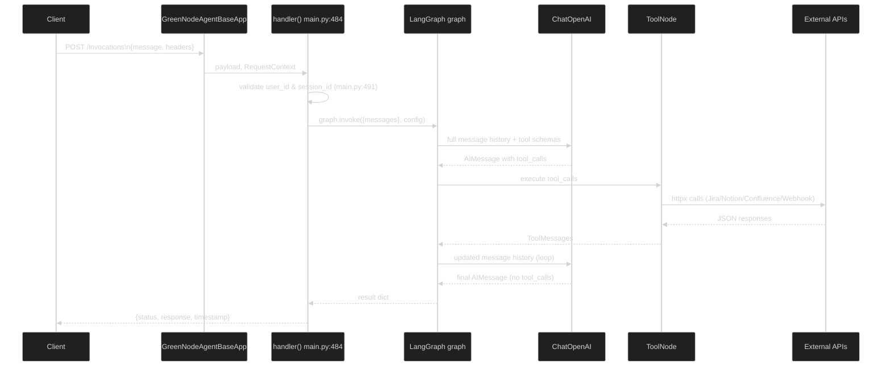

# agent007 — Principal-Level Onboarding

> Audience: Senior/staff+ engineers who need the *why* behind architectural decisions.

---

## 1. System Philosophy & Design Principles

**agent007** is a *work-management automation agent* deployed on VNGCloud's **GreenNode AgentBase** platform. It bridges a developer's daily workflow tools — Jira, Confluence, Notion — with an AI reasoning layer, and surfaces ambiguous situations for human review via Power Automate webhook.

Key invariants the system maintains:

1. **Stateless request handling** — each `/invocations` call is fully self-contained. Conversational continuity lives in the checkpointer/memory layer, not in process state.
2. **Single-source entrypoint** — the entire agent (tools, graph, HTTP server) lives in `main.py`. This was a deliberate decision for a competition hackathon context where a flat structure beats premature modularisation.
3. **OpenAI-compatible LLM abstraction** — `ChatOpenAI` from `langchain-openai` means the LLM provider can be swapped by changing three env vars (no code change). The agent ran against GreenNode AIP, OpenAI, and Ollama in development.
4. **Fail-loud on startup** — missing `MEMORY_ID` or any LLM env var causes an immediate `ValueError` at import time (`main.py:26-37`). A mis-configured agent that starts silently and fails at runtime is harder to debug than one that refuses to start.
5. **No redirect following on Jira/Confluence** — `follow_redirects=False` on httpx clients (`main.py:135,344`) — the Zalopay Atlassian instance sits behind Azure AD Application Proxy SSO. A redirect means the auth token is wrong, not that the URL moved. Following it would silently discard the Bearer token and return an HTML login page instead of a JSON error.

---

## 2. Architecture Overview

```mermaid
%%{init: {'theme': 'dark', 'themeVariables': {'primaryColor': '#1e293b', 'primaryTextColor': '#e2e8f0', 'primaryBorderColor': '#475569', 'lineColor': '#94a3b8', 'secondaryColor': '#0f172a', 'tertiaryColor': '#1e293b'}}}%%
graph TD
    A[HTTP Client] -->|POST /invocations| B[GreenNodeAgentBaseApp]
    A -->|GET /health| B
    B --> C[handler entrypoint]
    C --> D[LangGraph graph.invoke]
    D --> E[chatbot node\nChatOpenAI + tools]
    E -->|tool_calls| F[ToolNode\n9 tools]
    F -->|tool results| E
    E -->|no more calls| G[Final AI message]
    G --> C
    C --> A

    E <-->|checkpoint| H[AgentBaseMemoryEvents\nshort-term session memory]
    F2[remember / recall tools] <-->|vector search| I[MemoryClient\nlong-term semantic memory]
    F --> F2

    subgraph External APIs
        J[Jira REST API\njira.zalopay.vn]
        K[Notion API\napi.notion.com]
        L[Confluence REST API\nconfluence.zalopay.vn]
        M[Power Automate Webhook]
    end

    F --> J
    F --> K
    F --> L
    F --> M

    style H fill:#1e3a5f,stroke:#3b82f6
    style I fill:#1e3a5f,stroke:#3b82f6
```



**Component ownership:**
| Component | File | Purpose |
|---|---|---|
| HTTP server & routing | `main.py:21` | `GreenNodeAgentBaseApp` wraps a FastAPI/uvicorn server |
| LangGraph state machine | `main.py:452-481` | ReAct-style chatbot↔tools loop |
| Tool registry | `main.py:456-466` | 9 `@tool`-decorated callables |
| Short-term memory | `main.py:29` | `AgentBaseMemoryEvents` checkpointer |
| Long-term memory | `main.py:31` | `MemoryClient` vector store |
| Auth helpers | `main.py:65-70` | Bearer-only; no Basic Auth |

---

## 3. Key Abstractions & Interfaces

### `GreenNodeAgentBaseApp` (`main.py:21`)
The top-level application object from `greennode_agentbase`. It:
- Mounts an HTTP server on `0.0.0.0:PORT`
- Routes `POST /invocations` to the function decorated with `@app.entrypoint`
- Routes `GET /health` to the function decorated with `@app.ping`
- Manages IAM authentication transparently when deployed on AgentBase Runtime

### `RequestContext` (`main.py:485`)
Injected by the SDK into the entrypoint. Carries:
- `context.user_id` — from `X-GreenNode-AgentBase-User-Id` header
- `context.session_id` — from `X-GreenNode-AgentBase-Session-Id` header

Both are **required** and validated at runtime (`main.py:491-496`). They double as:
- `thread_id` → LangGraph checkpointer key (session isolation)
- `actor_id` → long-term memory namespace key (user isolation)

### LangGraph `State` (`main.py:452-453`)
```python
class State(TypedDict):
    messages: Annotated[list, add_messages]
```
The entire graph state is a message list. `add_messages` is a reducer that appends (not replaces) on each state update. The LLM receives the full message history plus the checkpointed prior messages.

### `@tool` decorated functions (`main.py:83-448`)
LangChain `@tool` turns a Python function into a `StructuredTool`. The docstring becomes the tool description that the LLM uses for routing decisions. The `Args:` section in the docstring maps to JSON schema parameters.

---

## 4. Decision Log

| Decision | Choice | Alternatives Considered | Trade-off |
|---|---|---|---|
| Agent framework | LangGraph | LangChain AgentExecutor, raw function calling loop | LangGraph's explicit graph gives deterministic control flow and native checkpointer support; AgentExecutor is simpler but harder to extend |
| Memory strategy | Two-tier (short + long) | Single checkpointer only | Checkpointer handles conversational context within a session; MemoryClient persists user-specific facts across sessions |
| Single-file structure | `main.py` | Package structure with tools/, routes/ | Hackathon optimisation — reduces file navigation overhead; acceptable for this scale |
| HTTP client | `httpx` (sync) | `requests`, `aiohttp` | httpx is modern and supports both sync and async; explicit timeouts prevent hang-until-death on Atlassian |
| LLM abstraction | `langchain-openai` `ChatOpenAI` | Direct `openai` SDK, `litellm` | Provider-agnostic via `base_url`; team already familiar with LangChain |
| Jira auth | Bearer PAT | Basic Auth (username:password) | Zalopay's Jira is behind Azure AD Application Proxy — only PAT works; Basic Auth triggers SSO redirect |

---

## 5. Dependency Rationale

| Package | Why | What it replaced |
|---|---|---|
| `greennode-agentbase` | Platform SDK — provides `GreenNodeAgentBaseApp`, `MemoryClient`, IAM token management | Raw uvicorn/FastAPI server |
| `greennode-agent-bridge[langgraph]` | Provides `AgentBaseMemoryEvents` — LangGraph checkpointer backed by AgentBase memory events | LangGraph's `MemorySaver` (in-process, not persistent) |
| `langgraph>=1.0.0` | Stateful agent graph with checkpointing and conditional edges | LangChain AgentExecutor |
| `langchain-openai` | `ChatOpenAI` wrapper — OpenAI-compatible LLM that works with any base_url | Direct `openai` client (requires more glue code to bind tools) |
| `httpx` | HTTP client with timeout control and redirect handling | `requests` (less control over redirects, no async path) |
| `python-dotenv` | Loads `.env` for local development | Manual `os.environ` exports |

---

## 6. Data Flow & State

### Invocation flow (traced through code)



### Memory namespacing (`main.py:79`)

```
/strategies/{MEMORY_STRATEGY_ID}/actors/{actor_id}
```

- `MEMORY_STRATEGY_ID` defaults to `"default"` — determines the memory extraction/eviction strategy configured on the platform
- `actor_id` = `user_id` from request header — isolates memories per user
- The checkpointer uses `thread_id` = `session_id` — isolates conversation history per session

---

## 7. Failure Modes & Error Handling

| Failure | Where | Handling |
|---|---|---|
| Missing env vars at startup | `main.py:26,36` | `ValueError` immediately — process won't start |
| Jira/Confluence SSO redirect (301-308) | `main.py:144-149,192,358` | Returns human-readable string explaining Azure AD OAuth2 constraint; does not follow redirect |
| Jira/Confluence HTTP error | `main.py:150,193,359` | Returns `"Jira API error (HTTP {code}): ..."` string to the LLM |
| Network error (DNS, timeout) | `main.py:152,195,361` | Returns `"Network error: ..."` string to the LLM |
| Tool exception | `main.py:477` | `handle_tool_errors=lambda e: f"Tool error ..."` — LangGraph catches and surfaces as a message |
| Missing user_id/session_id | `main.py:491-496` | Returns `{"status": "error", "error": "..."}` immediately, graph never invoked |
| Webhook not configured | `main.py:427-431` | Graceful degradation — returns a visible `[Review needed — webhook not configured]` message |

**Error propagation model**: Errors from external APIs are returned as *strings* to the LLM rather than raised as exceptions. This allows the LLM to reason about the failure and potentially try an alternative action or inform the user.

---

## 8. Performance Characteristics

**Bottlenecks:**
- LLM inference round-trips dominate latency. Each tool-call cycle adds one LLM invocation (~1-5s depending on provider).
- External API calls are synchronous and sequential within a single graph execution. Jira + Notion calls in the same turn are not parallelised.
- `httpx.Client(timeout=30)` — each external call can take up to 30 seconds. Webhook has a tighter `timeout=15` (`main.py:432`).

**Scaling limits:**
- Single-process uvicorn server (no workers configured in `Dockerfile`/`main.py`). The GreenNode AgentBase Runtime handles horizontal scaling at the container level.
- `maxResults=50` on Jira JQL queries (`main.py:139`) — not paginated. Large Jira projects will silently return only the 50 most-recently-updated issues.
- Notion page query `page_size: 100` (`main.py:259`) — single page fetch, not paginated.

---

## 9. Security Model

**Trust boundaries:**

```mermaid
%%{init: {'theme': 'dark', 'themeVariables': {'primaryColor': '#1e293b', 'primaryTextColor': '#e2e8f0', 'lineColor': '#94a3b8'}}}%%
graph LR
    subgraph Untrusted
        C[HTTP Client]
    end
    subgraph AgentBase Runtime - Trusted
        SDK[GreenNode SDK\nIAM validation]
        Agent[agent007 process]
    end
    subgraph External - Semi-trusted
        J[Jira PAT]
        N[Notion Token]
        CF[Confluence PAT]
        PA[Power Automate]
    end

    C -->|headers validated by SDK| SDK
    SDK --> Agent
    Agent -->|Bearer PAT| J
    Agent -->|Bearer token| N
    Agent -->|Bearer PAT| CF
    Agent -->|HTTPS POST| PA

    style SDK fill:#1e3a5f,stroke:#3b82f6
```



- **Inbound auth**: Managed by the GreenNode AgentBase Runtime when deployed. Locally, no auth is enforced — the SDK trusts the headers as-is.
- **Secrets**: All credentials in environment variables or `.greennode.json`. The `.env` file is gitignored (`main.py` calls `load_dotenv()` at line 19).
- **Outbound auth**: Bearer PAT for Jira/Confluence; Bearer integration token for Notion. No OAuth2 flows are implemented.
- **SSO constraint**: Jira/Confluence at `*.zalopay.vn` sit behind Azure AD Application Proxy. PAT bypasses the proxy only if the proxy is configured to allow it — redirect detection (`main.py:144`) guards against silent token leakage to the SSO endpoint.
- **Data sensitivity**: Memory records contain user task information. The memory namespace (`/strategies/.../actors/{user_id}`) provides per-user isolation but relies on the platform enforcing namespace access control.

---

## 10. Testing Strategy

There are currently **no automated tests** in this repository. This was an acceptable trade-off for a hackathon timeline.

What *would* need testing if this were production:
- Tool functions — unit test each `@tool` function with mocked `httpx` responses
- LangGraph graph — integration test `graph.invoke` with a mock LLM and real tool functions
- Auth helpers — test `_jira_auth()`/`_confluence_auth()` return correct header format
- Memory helpers — test `_build_namespace()` with various actor_id inputs
- Error handling — test redirect detection logic in Jira/Confluence tools

---

## 11. Operational Concerns

**Deployment:**
1. Build Docker image: `docker build -t agent007 .`
2. Push to VNGCloud Container Registry (`vcr.vngcloud.vn/111480-abp112117`)
3. Create/update Runtime at AgentBase Console with `MEMORY_ID`, LLM vars, and external API tokens as injected secrets

**Configuration surface:**
- `.greennode.json` — client_id/secret for local SDK auth, agent_identity name
- `.env` — all credentials and feature config (see `.env.example`)
- `MEMORY_STRATEGY_ID` — controls the memory extraction strategy; defaults to `"default"`

**Health check:**
- `GET /health` → `PingStatus.HEALTHY` (always, no deep checks) (`main.py:519-521`)

**Observability:**
- No structured logging, metrics, or distributed tracing are implemented. Tool errors surface as strings in the response payload.

**Feature flags:** None.

---

## 12. Known Technical Debt

| Item | Risk | Location |
|---|---|---|
| No pagination on Jira/Notion queries | Silently misses tasks in large workspaces | `main.py:139,259` |
| Single-file architecture | Will become unmaintainable beyond ~10 tools | `main.py` |
| Synchronous httpx calls | Cannot parallelise tool calls; hurts latency when multiple APIs are queried | All tool functions |
| No automated tests | Regressions are invisible until runtime | — |
| `follow_redirects=False` in Confluence update (`main.py:381`) but not the `get` call inside it | Inconsistency — if Confluence redirects on the GET, it's silently followed | `main.py:381,384` |
| `.greennode.json` client_secret in plaintext | Credential leak if repo is made public | `.greennode.json` |
| Notion `update_notion_todo` tries both `Done` checkbox and `Status` property blindly | Will cause Notion 400 errors if the database schema doesn't have both properties | `main.py:292-296` |
